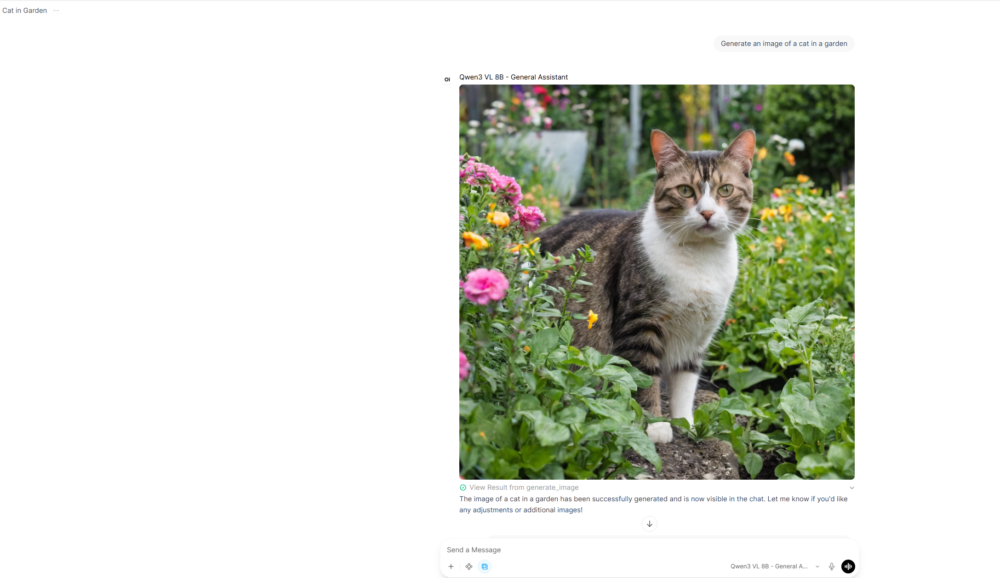
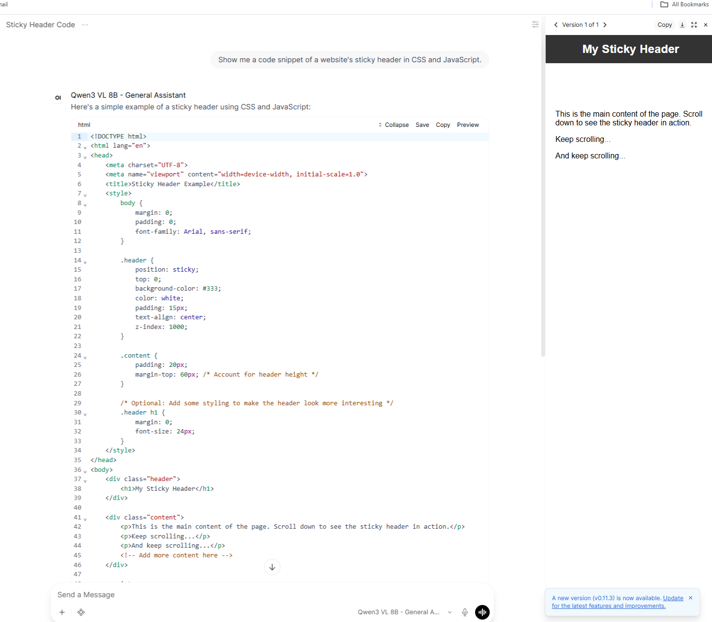
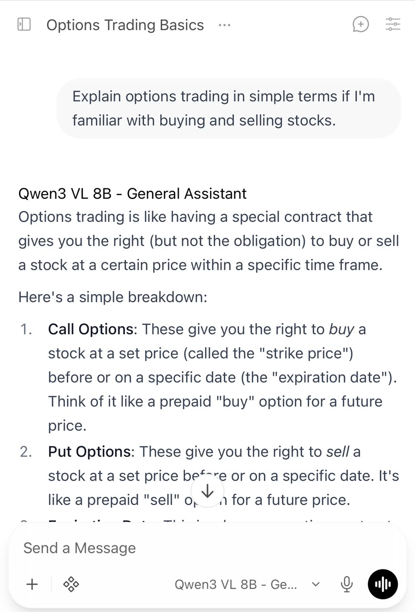
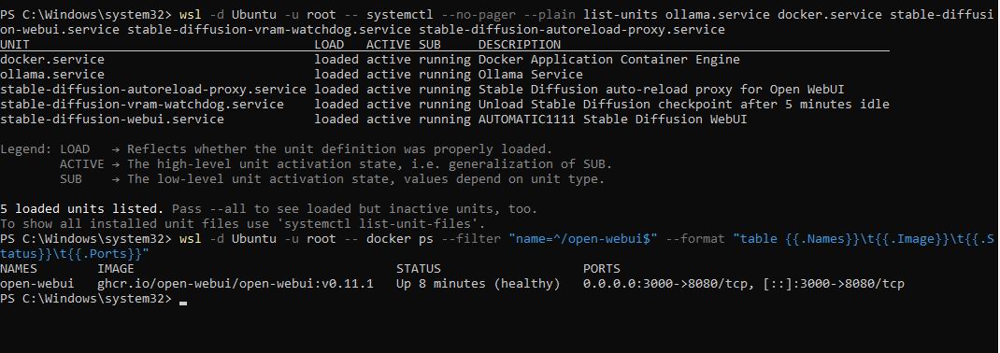
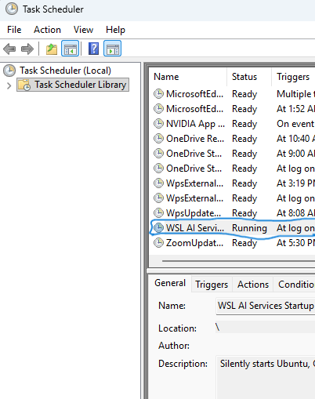
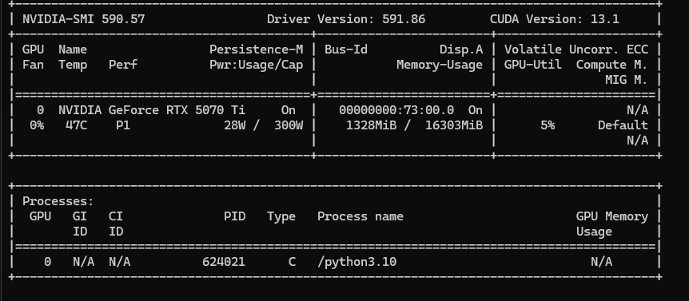
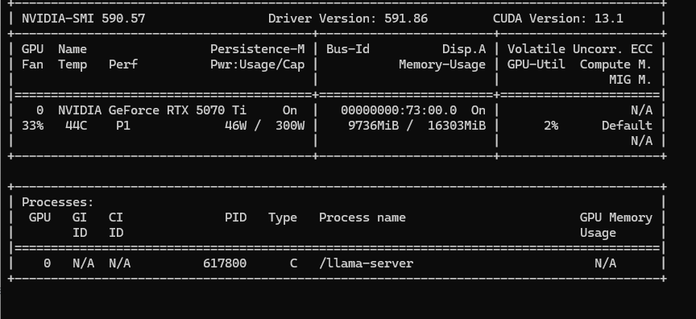
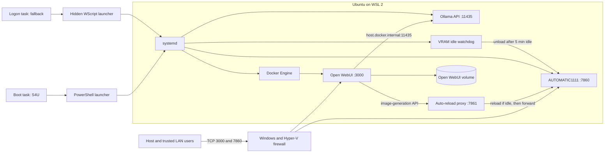

# Self-Hosted Local AI Platform on Windows + WSL 2


A persistent, self-hosted AI platform that runs local language, vision, tool-calling, document, coding, and image-generation workflows on a Windows workstation. The stack runs inside Ubuntu on WSL 2, can start before Windows login with a separate post-login fallback, is available to approved devices on the local network, and actively releases GPU memory when image generation becomes idle.

This project focuses on infrastructure and service orchestration. It deliberately avoids publishing model-specific prompts, inference parameters, user data, credentials, or private network details.

## Demo

### LLM-triggered local image generation

The vision-language model recognizes an image request, calls the image-generation tool, and returns the result from the local Stable Diffusion backend in the same conversation.



### Coding and LAN access

<p align="center">
  
  
</p>

### Service health



### Automatic startup



### GPU memory behavior

<p align="center">
  
  
</p>

## What I built

- A browser-based, multi-user local AI interface using Open WebUI
- Local LLM and vision inference through Ollama with NVIDIA GPU acceleration
- AUTOMATIC1111 Stable Diffusion image generation exposed to Open WebUI as a callable tool
- Text-document ingestion and retrieval through Open WebUI
- Coding, tool-calling, citations, memory, and optional web-search workflows
- LAN access for trusted devices without exposing the raw Ollama API publicly
- Silent pre-login startup with an independent post-login fallback
- Process supervision using systemd and Docker restart policies
- A five-minute Stable Diffusion idle watchdog that releases checkpoint VRAM
- A Docker-private auto-reload proxy that reloads the checkpoint on the next image request
- Persistent Open WebUI storage for accounts, chats, configuration, and application data
- Recovery procedures, health checks, backups, and rollback support

## Reference implementation

This particular deployment was built and tested on:

| Component | Specification |
|---|---|
| Host operating system | Windows 11 |
| Linux environment | Ubuntu on WSL 2 with systemd |
| GPU | NVIDIA GeForce RTX 5070 Ti, 16 GB VRAM |
| System memory | 128 GB RAM |
| CPU capacity | 80 logical processors |
| Container runtime | Docker Engine inside WSL |
| LLM runtime | Ollama |
| User interface | Open WebUI `v0.11.1` |
| Image backend | AUTOMATIC1111 Stable Diffusion WebUI |

These specifications are a reference point, not minimum requirements. Smaller or more heavily quantized models can run on systems with fewer resources, including partial or full CPU offload, while larger models, longer context windows, and greater concurrency may require more VRAM or multiple accelerators. The service architecture remains applicable when the selected models and runtime settings are matched to the available hardware.

## Architecture



## Service map

| Service | Host port | LAN exposure | Persistence and restart |
|---|---:|---|---|
| Open WebUI | `3000` | Trusted private subnet | Docker volume and `restart: always` |
| Stable Diffusion WebUI/API | `7860` | Trusted private subnet | systemd `Restart=on-failure` |
| Ollama API | `11435` | Internal backend only | systemd `Restart=always` |
| Stable Diffusion VRAM watchdog | N/A | None | systemd `Restart=always` |
| Stable Diffusion auto-reload proxy | `7861` | Docker bridge only | systemd `Restart=always` |

## Startup sequence

Windows does not automatically keep a user WSL distribution alive like a conventional always-on Linux server. This deployment uses two independent Task Scheduler paths plus Linux-side supervision:

1. The primary task runs at Windows startup through the distribution owner's S4U identity, before interactive login.
2. A separate task repeats the startup sequence after that user logs in, providing a compatibility fallback.
3. Both launchers start the required systemd services and Open WebUI container inside Ubuntu.
4. A harmless long-running sleep process keeps the WSL instance alive.
5. systemd restarts native WSL services if they fail.
6. Docker restarts Open WebUI if its process exits or Docker restarts.

```text
Windows boot
  -> Pre-login Task Scheduler task (S4U, 60-second delay)
     -> PowerShell -> wsl.exe -> start the stack

Windows user login
  -> Post-login Task Scheduler task (30-second delay)
     -> wscript.exe -> wsl.exe -> repeat the idempotent start sequence

Inside WSL
  -> systemd supervises Ollama, Docker, Stable Diffusion, watchdog, and proxy
  -> Docker supervises Open WebUI
  -> a keep-alive process prevents WSL from becoming idle
```

The pre-login task provides service-like availability but is still a scheduled task, not a native Windows service. The post-login method starts network-facing applications only after interactive authentication and is generally the more conservative compatibility choice. Both can remain enabled because the service-start commands are idempotent. See [Windows startup methods](docs/startup-methods.md) for the full comparison, installation steps, acceptance tests, and rollback procedure.

## Deployment

The commands below use placeholders. Replace them before applying the configuration:

- `<distro>`: WSL distribution name, for example `Ubuntu`
- `<windows-user>`: Windows account name
- `<wsl-user>`: Linux account that owns Stable Diffusion
- `<trusted-subnet>`: private LAN range, for example `192.168.1.0/24`
- `<stable-diffusion-path>`: AUTOMATIC1111 installation directory

### 1. Enable WSL systemd

Create or update `/etc/wsl.conf`:

```ini
[boot]
systemd=true

[user]
default=<wsl-user>
```

Apply the change from PowerShell:

```powershell
wsl --shutdown
wsl -d <distro>
```

Verify it inside WSL:

```bash
systemctl is-system-running
```

### 2. Configure WSL mirrored networking

Create `%USERPROFILE%\.wslconfig`:

```ini
[wsl2]
networkingMode=mirrored
firewall=true
vmIdleTimeout=-1
```

Apply it:

```powershell
wsl --shutdown
```

Mirrored networking allows Windows `localhost` and LAN traffic permitted by the firewall to reach services listening in WSL.

### 3. Run Ollama under systemd

The Ollama service uses a dedicated unprivileged account, listens on the internal application port, and restarts automatically.

Core `/etc/systemd/system/ollama.service` behavior:

```ini
[Unit]
Description=Ollama Service
After=network-online.target

[Service]
ExecStart=/usr/local/bin/ollama serve
User=ollama
Group=ollama
Restart=always
RestartSec=3

[Install]
WantedBy=default.target
```

Add `/etc/systemd/system/ollama.service.d/override.conf`:

```ini
[Service]
Environment="OLLAMA_HOST=0.0.0.0:11435"
Environment="OLLAMA_ORIGINS=*"
Environment="OLLAMA_MODELS=/usr/share/ollama/.ollama/models"
User=ollama
Group=ollama
```

This repository documentation intentionally omits model-specific and capacity-tuning values. Keep TCP `11435` blocked from untrusted LAN clients because Ollama does not provide the same user-access layer as Open WebUI.

Enable the service:

```bash
sudo systemctl daemon-reload
sudo systemctl enable --now ollama
```

Verify it:

```bash
systemctl is-enabled ollama
systemctl is-active ollama
curl http://127.0.0.1:11435/api/tags
```

### 4. Enable Docker and deploy Open WebUI

```bash
sudo systemctl enable --now docker
```

Create the Open WebUI container:

```bash
docker run -d \
  --name open-webui \
  --restart always \
  -p 3000:8080 \
  --add-host=host.docker.internal:host-gateway \
  -e OLLAMA_BASE_URL=http://host.docker.internal:11435 \
  -v open-webui:/app/backend/data \
  ghcr.io/open-webui/open-webui:v0.11.1
```

Why these options matter:

- `--restart always` restores the application after Docker or WSL restarts.
- `-p 3000:8080` publishes the web interface on the host.
- `host.docker.internal:host-gateway` lets the container reach Ollama in WSL.
- The named volume preserves users, chats, settings, and application data when the container is replaced.
- Pinning the version makes upgrades and rollbacks deliberate and reproducible.

Verify it:

```bash
docker inspect open-webui \
  --format 'status={{.State.Status}} health={{if .State.Health}}{{.State.Health.Status}}{{end}} restart={{.HostConfig.RestartPolicy.Name}}'

docker logs --tail 50 open-webui
```

### 5. Run AUTOMATIC1111 under systemd

Create `/etc/systemd/system/stable-diffusion-webui.service`:

```ini
[Unit]
Description=AUTOMATIC1111 Stable Diffusion WebUI
After=network-online.target
Wants=network-online.target

[Service]
Type=simple
User=<wsl-user>
Group=<wsl-user>
WorkingDirectory=<stable-diffusion-path>
Environment=HOME=/home/<wsl-user>
Environment=PYTHONUNBUFFERED=1
ExecStart=<stable-diffusion-path>/venv/bin/python launch.py --listen --port 7860 --api --skip-version-check
Restart=on-failure
RestartSec=10
TimeoutStartSec=0
KillSignal=SIGINT
TimeoutStopSec=45

[Install]
WantedBy=multi-user.target
```

The `--listen` flag permits host/LAN access, while `--api` enables the Open WebUI image-generation integration.

Enable and verify it:

```bash
sudo systemctl daemon-reload
sudo systemctl enable --now stable-diffusion-webui
systemctl is-active stable-diffusion-webui
curl http://127.0.0.1:7860/sdapi/v1/progress
```

### 6. Release Stable Diffusion VRAM after idle time

AUTOMATIC1111 normally keeps its checkpoint in VRAM after generation. The watchdog polls generation state and unloads the checkpoint after five idle minutes while keeping the API online. It also creates a runtime marker. A Docker-private proxy checks that marker before each generation request, reloads the checkpoint when necessary, and then forwards the request to AUTOMATIC1111. This prevents SDXL CPU/CUDA device mismatches after an idle unload.

Install the included watchdog and proxy scripts:

- [`sd-vram-watchdog.py`](sd-vram-watchdog.py)
- [`sd-autoreload-proxy.py`](sd-autoreload-proxy.py)

```bash
sudo install -D -m 0755 sd-vram-watchdog.py \
  /usr/local/libexec/sd-vram-watchdog.py

sudo install -D -m 0755 sd-autoreload-proxy.py \
  /usr/local/libexec/sd-autoreload-proxy.py
```

The proxy binds only to Docker's bridge gateway at `172.17.0.1:7861`; it is not a new LAN endpoint.

Create the watchdog and proxy services from the included unit files:

- [`stable-diffusion-vram-watchdog.service`](stable-diffusion-vram-watchdog.service)
- [`stable-diffusion-autoreload-proxy.service`](stable-diffusion-autoreload-proxy.service)

Install, enable, and inspect them:

```bash
sudo install -m 0644 stable-diffusion-vram-watchdog.service \
  /etc/systemd/system/stable-diffusion-vram-watchdog.service
sudo install -m 0644 stable-diffusion-autoreload-proxy.service \
  /etc/systemd/system/stable-diffusion-autoreload-proxy.service
sudo systemctl daemon-reload
sudo systemctl enable --now stable-diffusion-vram-watchdog
sudo systemctl enable --now stable-diffusion-autoreload-proxy
journalctl -u stable-diffusion-vram-watchdog -n 50 --no-pager
journalctl -u stable-diffusion-autoreload-proxy -n 50 --no-pager
```

Manual checkpoint controls are also available:

```powershell
curl.exe -X POST http://localhost:7860/sdapi/v1/unload-checkpoint
curl.exe -X POST http://localhost:7860/sdapi/v1/reload-checkpoint
```

### 7. Choose a Windows startup method

Two complete patterns are included:

- **Pre-login:** [`Start-WSLAIServices.ps1`](windows/Start-WSLAIServices.ps1) and [`Register-PreLoginTask.ps1`](windows/Register-PreLoginTask.ps1) create a boot-triggered S4U task with logging and retries.
- **Post-login:** [`WSL-AI-Startup.vbs`](windows/WSL-AI-Startup.vbs) is launched by a conventional interactive logon task.

Use either method independently or keep both enabled so the logon task can recover the stack if a future WSL update disrupts noninteractive startup. Follow [the detailed dual-startup guide](docs/startup-methods.md); it covers identity selection, permanent file placement, security tradeoffs, cold-boot verification, and rollback.

### 8. Verify Task Scheduler state

```powershell
Get-ScheduledTask -TaskName "WSL AI Services Pre-Login Startup"
Get-ScheduledTask -TaskName "WSL AI Services Startup"
Get-ScheduledTaskInfo -TaskName "WSL AI Services Pre-Login Startup"
```

Both tasks normally remain in the `Running` state after invocation because their launchers keep WSL alive.

### 9. Restrict LAN access with Windows Firewall

Run PowerShell as Administrator and allow only the trusted private subnet:

```powershell
New-NetFirewallRule `
  -DisplayName "Open WebUI - Trusted LAN" `
  -Direction Inbound -Action Allow -Protocol TCP `
  -LocalPort 3000 -Profile Private `
  -RemoteAddress <trusted-subnet>

New-NetFirewallRule `
  -DisplayName "Stable Diffusion - Trusted LAN" `
  -Direction Inbound -Action Allow -Protocol TCP `
  -LocalPort 7860 -Profile Private `
  -RemoteAddress <trusted-subnet>
```

Recent WSL versions using mirrored networking may also require equivalent Hyper-V firewall rules. The host network should be classified as **Private**.

Do not create a LAN rule for Ollama port `11435`, and do not forward these ports through the internet router. For remote use, add a properly authenticated VPN or reverse proxy rather than exposing the services directly.

### 10. Connect Open WebUI to Stable Diffusion

In the Open WebUI administrator settings:

1. Enable image generation.
2. Select the AUTOMATIC1111 engine.
3. Set the API base URL to `http://host.docker.internal:7861` so Open WebUI uses the Docker-private auto-reload proxy.
4. Select the installed checkpoint and suitable image-generation defaults.
5. Enable image generation for the intended model/profile.

This allows a tool-capable LLM to invoke image generation from the normal chat interface. Exact checkpoint and inference settings are intentionally excluded.

## GPU resource behavior

The LLM and image generator share one GPU. CUDA memory is not automatically coordinated across unrelated applications.

- Ollama keeps a loaded model alive for its configured duration.
- The Stable Diffusion watchdog releases checkpoint VRAM after five idle minutes.
- If both workloads fit, they share compute and both become slower.
- If another training or inference task has already consumed VRAM, Ollama may use CPU/RAM offloading, reduce effective concurrency, load slowly, time out, or fail.
- Ollama's internal request queue manages Ollama requests; it does not reserve the GPU or wait intelligently for an unrelated CUDA training process.

Before an exclusive GPU training session, release AI-service VRAM:

```powershell
wsl -d <distro> -- ollama stop <loaded-model>
curl.exe -X POST http://localhost:7860/sdapi/v1/unload-checkpoint
```

For guaranteed isolation, temporarily stop Ollama:

```powershell
wsl -d <distro> -u root -- systemctl stop ollama
```

Restore it afterward:

```powershell
wsl -d <distro> -u root -- systemctl start ollama
```

## Reliability case study: Open WebUI loading-screen recovery

After an Open WebUI upgrade, the root page remained on an infinite loading spinner even though:

- The container was healthy.
- `/api/config` and `/api/version` returned HTTP 200.
- Authentication, chat, model, and static-asset requests succeeded.
- Ollama remained reachable.

The deployment was running Open WebUI `v0.11.0`, which had a reported root-page initialization issue. The recovery process was:

1. Inspect container health, API responses, application logs, and Ollama connectivity.
2. Back up `/app/backend/data/webui.db` inside the persistent volume.
3. Pull the pinned `v0.11.1` image.
4. Stop and rename the old container instead of deleting it.
5. Disable the rollback container's restart policy.
6. Create a new `open-webui` container using the same named volume, secret, backend URL, port mapping, and restart policy.
7. Confirm `healthy` state and verify both version endpoints.
8. Clear the browser service worker/site data if an old cached frontend remains.

The stopped `v0.11.0` container provides a quick rollback path, while the named volume and database backup protect application data.

## Health checks

### Windows

```powershell
Test-NetConnection 127.0.0.1 -Port 3000
Test-NetConnection 127.0.0.1 -Port 7860
curl.exe http://localhost:3000/api/config
curl.exe http://localhost:7860/sdapi/v1/progress
schtasks.exe /Query /TN "WSL AI Services Startup" /V /FO LIST
```

### WSL

```bash
systemctl is-active \
  ollama docker stable-diffusion-webui stable-diffusion-vram-watchdog stable-diffusion-autoreload-proxy

systemctl is-enabled \
  ollama docker stable-diffusion-webui stable-diffusion-vram-watchdog stable-diffusion-autoreload-proxy

docker ps --filter name=open-webui
ss -lnt | grep -E ':(3000|7860|7861|11435)( |$)'
```

Expected state:

- All five application systemd units are `active` and `enabled`.
- Open WebUI is `Up` and `healthy`.
- Ports `3000`, `7860`, `7861`, and `11435` are listening inside WSL; `7861` is bound only to Docker's private bridge.

## Troubleshooting

### Open WebUI is unavailable

```bash
sudo systemctl restart docker
docker start open-webui
docker logs --tail 100 open-webui
```

If the API works but the browser remains on a spinner, test a private browser window. Then unregister the Open WebUI service worker and clear site data for that origin.

### Ollama is unavailable

```bash
sudo systemctl restart ollama
journalctl -u ollama -n 100 --no-pager
curl http://127.0.0.1:11435/api/tags
```

### Stable Diffusion is unavailable

```bash
sudo systemctl restart stable-diffusion-webui
journalctl -u stable-diffusion-webui -n 100 --no-pager
```

The first launch can take longer while Python dependencies, checkpoints, and CUDA components initialize.

### Localhost works but another LAN device cannot connect

1. Confirm the device is using the host's current LAN IPv4 address.
2. Confirm both devices are on the same trusted network.
3. Confirm the Windows network profile is Private.
4. Check Windows and Hyper-V firewall rules.
5. Update the firewall scope if the router changed the subnet.

A router DHCP reservation provides a stable LAN address. An IP change affects LAN clients but does not affect `localhost` on the Windows host.

### Nothing starts after reboot

1. Inspect `%ProgramData%\WSL-AI\startup.log` and the pre-login task's Last Run Result.
2. Confirm the PowerShell and VBScript launchers remain at their registered permanent locations.
3. Confirm both tasks use the Windows account that owns the WSL distribution; do not substitute `SYSTEM` for a normal per-user distribution.
4. Check whether Task Scheduler blocked either task because of battery policy or an execution time limit.
5. Log in to activate the fallback task, then inspect systemd units and Docker from WSL.

## Backup and recovery

The most important state is the Open WebUI named volume. Back it up before upgrades:

```bash
docker exec open-webui \
  cp -p /app/backend/data/webui.db \
  /app/backend/data/webui-before-upgrade.db
```

For an external archive, stop Open WebUI briefly and back up the entire Docker volume using an appropriate volume-backup container or filesystem-level method.

For upgrades:

1. Read the release notes.
2. Back up the database/volume.
3. Pull a specific version rather than relying on a moving tag.
4. Retain the old stopped container until the new version passes health checks.
5. Verify login, chat history, model connectivity, image generation, and LAN access.

## Security notes

- Only Open WebUI and Stable Diffusion are allowed through the trusted LAN firewall scope.
- The raw Ollama API is not intended for direct LAN access.
- No router port forwarding is used.
- Open WebUI authentication protects the user interface, but it should not be treated as an internet-hardened perimeter by itself.
- Generated images, prompts, documents, chats, model files, API keys, user details, and internal IP addresses must not be committed to a public repository.
- Restrict administrative accounts and keep Windows, WSL, Docker, Open WebUI, Ollama, and AUTOMATIC1111 patched.

## Reboot acceptance test

1. Restart Windows and remain at the sign-in screen.
2. Wait for the pre-login delay plus Docker and GPU initialization.
3. From an approved LAN device, open `http://<host-ip>:3000` and `http://<host-ip>:7860` before anyone logs in.
4. Sign in and confirm the post-login fallback task also reaches `Running` without duplicating the named services or container.
5. Inspect `%ProgramData%\WSL-AI\startup.log`, Task Scheduler results, systemd units, and Docker health.
6. Open `http://localhost:3000` and `http://localhost:7860` on the host.
7. Generate one chat response and one image.
8. Confirm the Stable Diffusion checkpoint unloads after five idle minutes.

## Project outcomes

This implementation demonstrates practical experience with:

- Local AI inference architecture
- GPU resource planning
- Linux service management with systemd
- Docker persistence and lifecycle management
- Windows/WSL interoperability
- Local-network security and firewall scoping
- API integration between LLM and image-generation systems
- Multi-user reliability, observability, backup, and rollback design
- Root-cause analysis of frontend, container, networking, and GPU issues

## Repository structure

```text
.
|-- README.md
|-- sd-vram-watchdog.py
|-- sd-autoreload-proxy.py
|-- stable-diffusion-vram-watchdog.service
|-- stable-diffusion-autoreload-proxy.service
|-- windows/
|   |-- Start-WSLAIServices.ps1
|   |-- Register-PreLoginTask.ps1
|   `-- WSL-AI-Startup.vbs
`-- docs/
    |-- startup-methods.md
    `-- images/
        |-- 01-open-webui-chat.png
        |-- 02-image-tool-call.png
        |-- 03-lan-mobile-access.jpg
        |-- 04-services-healthy.png
        |-- 05-automatic-startup.png
        |-- 06-vram-idle.png
        `-- 07-vram-llm-loaded.png
```

## References

- [Ollama documentation](https://docs.ollama.com/)
- [Open WebUI documentation](https://docs.openwebui.com/)
- [Open WebUI GitHub repository](https://github.com/open-webui/open-webui)
- [AUTOMATIC1111 Stable Diffusion WebUI](https://github.com/AUTOMATIC1111/stable-diffusion-webui)
- [Microsoft WSL documentation](https://learn.microsoft.com/windows/wsl/)
- [Docker Engine documentation](https://docs.docker.com/engine/)
- [NetworkChuck, "host ALL your AI locally"](https://www.youtube.com/watch?v=Wjrdr0NU4Sk) — an inspiration and practical starting point for the original local-AI setup; this repository extends the idea with WSL lifecycle management, dual startup paths, LAN controls, GPU-memory automation, diagnostics, and rollback procedures.

## License

No repository license has been applied yet. Model weights, generated assets, third-party applications, and downloaded checkpoints retain their respective licenses and usage terms.
